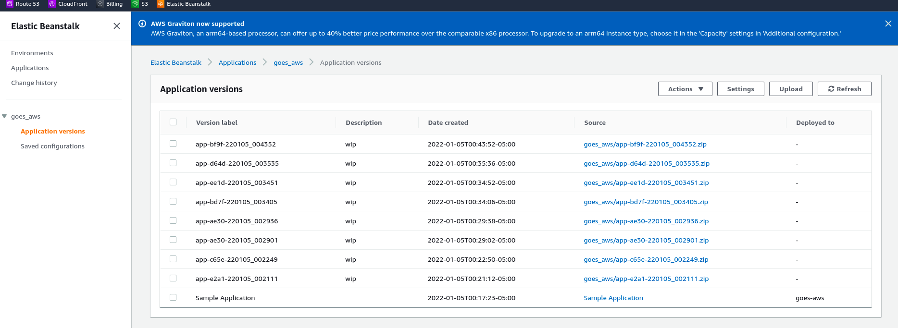
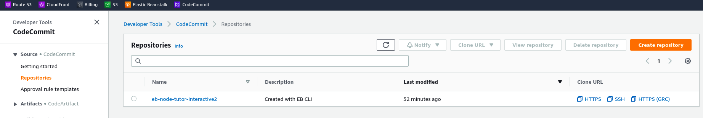
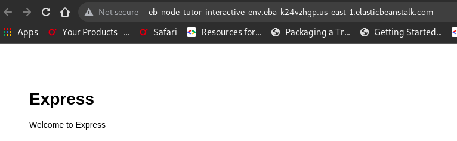
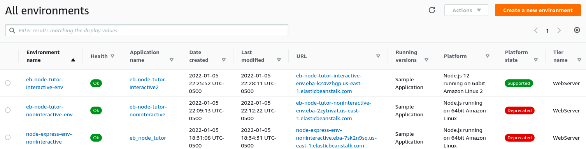
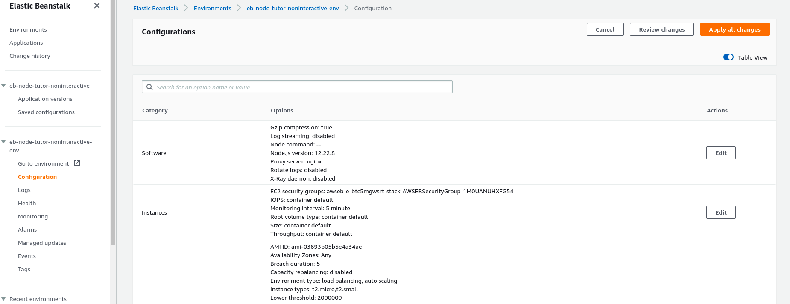
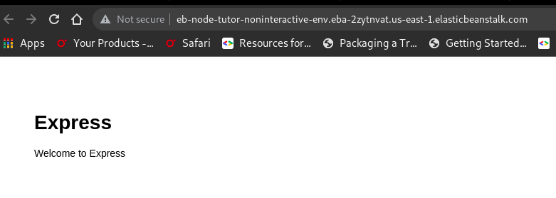

# Elastic beanstalk example app with  custom code

These are notes relative to this guide

https://docs.aws.amazon.com/elasticbeanstalk/latest/dg/create_deploy_nodejs_express.html

The notes headings are in sync with the headings in the doc

# Prerequisites
The docmentions three guides

* https://docs.aws.amazon.com/elasticbeanstalk/latest/dg/nodejs-devenv.html

This one is skipped, since it says you don't need the AWS SDK for Node.js

* https://docs.aws.amazon.com/elasticbeanstalk/latest/dg/eb-cli3-install.html

This one is for installing the EB CLI.  I did use this guide to install the eb tool.  It basically tells you to use this github repo for the scripts to install
the eb cli tool from scripts.  The url is shown as the fourth bullet here.

* https://docs.aws.amazon.com/elasticbeanstalk/latest/dg/eb-cli3-configuration.html

This one is for configuring the EB CLI.  I did use this guide to configure the eb tool.  I did learn something from this guide.  It instructs you to simply issue the `eb init` command.  The beauty of this mechanism is that it will prompt you for platform and node.js version.  More about this later.


* https://github.com/aws/aws-elastic-beanstalk-cli-setup

This is the url I used to install the cli and it fscked up my python environment.


# Notes on installing elastic beanstalk cli 

Use this url https://github.com/aws/aws-elastic-beanstalk-cli-setup

Follow the guide in the README.md

```
sudo apt-get install build-essential zlib1g-dev libssl-dev libncurses-dev libffi-dev libsqlite3-dev libreadline-dev libbz2-dev
```

Run this code.  Note, I learned this the hard way that the code
will dork with you python environment and install pyenv and python
from source.  IMHO, this script needs a pull request to ask if the user
wants to do this and a env variable to set for modifying the path.
I understand pyenv allows for differnt versions of python to be used.
ie. its not just a python -> points to python2 or python3, but the
ability to use multiple python3 implmentations.  However, I would
prefer it ask rather than blindly overwrite.

```
./aws-elastic-beanstalk-cli-setup/scripts/bundled_installer
```

After doing the install, it sets up pyenv and installs a custom python 3.7.  You also have to modify the path to point to the pyenv python3.7.

I made the following mods to `.bashrc` on Debian.

```
# for aws eb
export PATH="/home/davis/.ebcli-virtual-env/executables:$PATH"
# it installed pyenv and python
export PATH=/home/davis/.pyenv/versions/3.7.2/bin:$PATH

```


Later, in this guide it asks you to init eb.  Note this installs a version of specfic version of node.js.  NOTE: prior to restarting this tutorial I deleted all application versions and environments.  However, it takes some time for the environments to be actually deleted.  One thing to note is that when you click on an application, click on the application versions menu item in left-side side-bar.  There you can delete the applications and the associated S3 buckets.  See screenshot.




So given that setup, lets create two environments.  One for node.js version 12 and one using the command given in the tutorial for custom code apps.

A couple of things first though.  From what I have read earlier, here is a helpful `eb` commands of note.

## Listing environments

```
$ eb list

ERROR: This directory has not been set up with the EB CLI
You must first run "eb init".
```

Good.  This is a new directory.  I don't want any environments in place.

## .ebignore

There is this blurb in the `eb-cli3-configuration.html` url

```
When .ebignore is present, the EB CLI doesn't use git commands to create your source bundle. This means that EB CLI ignores files specified in .ebignore, and includes all other files. In particular, it includes uncommitted source files.
```

This is interesting.  I did notice that when using `eb` you create a git repo and changes are taken into account unless you not only `git add --all; git commit -m 'wip'` but that you also do a `git push` even though I have not provided an upstream master.  With that said, I would like to include this readme in an `.ebignore` but lets keep it simple and return to this option at a later time.

# Interactive Method for creating environment

Make a directory for this method and do the `eb init` command with proper naming convention.  Note, the guide in the git repo does not explain that you need to have a git repo.  Nor does it mention the name of the environment needs to use dashes instead of underscores.  See the error section at the end when I did this a second time.  (This is the third time)

```
$ mkdir eb-node-tutor-interactive
davis@twenty:~/progs 
$ cd eb-node-tutor-interactive/
davis@twenty:~/progs/eb-node-tutor-interactive 
```

## IM - Install express and init git

eb uses git to determine what is uploaded during eb deploy. This is how the second guide sets up the environment and it is part of their method to create the environment.  I'm using it here with the interactive method to see how it compares with the second guide.

```
$ express && npm install

  warning: the default view engine will not be jade in future releases
  warning: use `--view=jade' or `--help' for additional options


   create : public/
   create : public/javascripts/
   create : public/images/
   create : public/stylesheets/
   create : public/stylesheets/style.css
   create : routes/
   create : routes/index.js
   create : routes/users.js
   create : views/
   create : views/error.jade
   create : views/index.jade
   create : views/layout.jade
   create : app.js
   create : package.json
   create : bin/
   create : bin/www

   install dependencies:
     $ npm install

   run the app:
     $ DEBUG=eb-node-tutor-interactive:* npm start

npm WARN deprecated transformers@2.1.0: Deprecated, use jstransformer
npm WARN deprecated constantinople@3.0.2: Please update to at least constantinople 3.1.1
npm WARN deprecated jade@1.11.0: Jade has been renamed to pug, please install the latest version of pug instead of jade

added 99 packages, and audited 100 packages in 4s

5 vulnerabilities (1 low, 4 critical)

To address all issues (including breaking changes), run:
  npm audit fix --force

Run `npm audit` for details.
davis@twenty:~/progs/eb-node-tutor-interactive 
```

Init the directory with `git init` command.

```
$ git init
Initialized empty Git repository in /home/davis/progs/eb-node-tutor-interactive/.git/
davis@twenty:~/progs/eb-node-tutor-interactive 
```

Create a `.gitignore` file.

NOTE the direcotry name in the example is node-express. Later when we create the `.ebextensions` files, I need to keep this in mind. In the static files, part do they use this as part of the config?

```
node_modules/
.gitignore
.elasticbeanstalk/
```

Do the following to create this setup using bash here document.

```
$ cat <<EOF>> .gitignore
node_modules/
.gitignore
.elasticbeanstalk/
EOF
davis@twenty:~/progs/eb-node-tutor-interactive 
```

And then when I examined it aftewards, I noticed the earlier `eb init` left some files in the .gitignore file. 

```
$ cat .gitignore 
node_modules/
.gitignore
.elasticbeanstalk/
davis@twenty:~/progs/eb-node-tutor-interactive 
```

## IM - Init an Elastic Beanstalk environment

Using interactive mode

```
$ eb init
WARNING: Git is in a detached head state. Using branch "default".
WARNING: Git is in a detached head state. Using branch "default".
WARNING: Git is in a detached head state. Using branch "default".

Select a default region
1) us-east-1 : US East (N. Virginia)
2) us-west-1 : US West (N. California)
3) us-west-2 : US West (Oregon)
4) eu-west-1 : EU (Ireland)
5) eu-central-1 : EU (Frankfurt)
6) ap-south-1 : Asia Pacific (Mumbai)
7) ap-southeast-1 : Asia Pacific (Singapore)
8) ap-southeast-2 : Asia Pacific (Sydney)
9) ap-northeast-1 : Asia Pacific (Tokyo)
10) ap-northeast-2 : Asia Pacific (Seoul)
11) sa-east-1 : South America (Sao Paulo)
12) cn-north-1 : China (Beijing)
13) cn-northwest-1 : China (Ningxia)
14) us-east-2 : US East (Ohio)
15) ca-central-1 : Canada (Central)
16) eu-west-2 : EU (London)
17) eu-west-3 : EU (Paris)
18) eu-north-1 : EU (Stockholm)
19) eu-south-1 : EU (Milano)
20) ap-east-1 : Asia Pacific (Hong Kong)
21) me-south-1 : Middle East (Bahrain)
22) af-south-1 : Africa (Cape Town)
(default is 3): 1


Select an application to use
1) eb-node-tutor-interactive
2) eb_node_tutor
3) eb_node_tutor_interactive
4) goes_aws
5) [ Create new Application ]
(default is 1): 5


Enter Application Name
(default is "eb-node-tutor-interactive2"): 
WARNING: Git is in a detached head state. Using branch "default".
WARNING: Git is in a detached head state. Using branch "default".
WARNING: Git is in a detached head state. Using branch "default".
Application eb-node-tutor-interactive2 has been created.
WARNING: Git is in a detached head state. Using branch "default".

It appears you are using Node.js. Is this correct?
(Y/n): y

Select a platform branch.
1) Node.js 14 running on 64bit Amazon Linux 2
2) Node.js 12 running on 64bit Amazon Linux 2
3) Node.js 10 running on 64bit Amazon Linux 2 (Deprecated)
4) Node.js running on 64bit Amazon Linux (Deprecated)
(default is 1): 2

WARNING: Git is in a detached head state. Using branch "default".
Do you wish to continue with CodeCommit? (Y/n): y
WARNING: Git is in a detached head state. Using branch "default".

Select a repository
1) goes_aws
2) [ Create new Repository ]
(default is 2): 2
Enter Repository Name
(default is "eb-node-tutor-interactive"): eb-node-tutor-interactive2

Successfully created repository: eb-node-tutor-interactive2
WARNING: Git is in a detached head state. Using branch "default".

Enter Branch Name
***** Must have at least one commit to create a new branch with CodeCommit *****
(default is "default"): main
Successfully created branch: main
Do you want to set up SSH for your instances?
(Y/n): n
davis@twenty:~/progs/eb-node-tutor-interactive 

```


# IM - so what did this do?

## IM - eb list

```
$ eb list
<nothing>
```

## IM - eb console
Nothing was in the eb console

## IM - CodeCommit
It did create a repo in CodeCommit though.



## IM - Create an eb environment

```
$ eb create --sample eb-node-tutor-interactive-env
Setting up default branch
Environment details for: eb-node-tutor-interactive-env
  Application name: eb-node-tutor-interactive2
  Region: us-east-1
  Deployed Version: Sample Application
  Environment ID: e-pm4hk4bfpk
  Platform: arn:aws:elasticbeanstalk:us-east-1::platform/Node.js 12 running on 64bit Amazon Linux 2/5.4.9
  Tier: WebServer-Standard-1.0
  CNAME: UNKNOWN
  Updated: 2022-01-06 03:25:52.267000+00:00
Printing Status:
2022-01-06 03:25:50    INFO    createEnvironment is starting.
2022-01-06 03:25:52    INFO    Using elasticbeanstalk-us-east-1-265627204426 as Amazon S3 storage bucket for environment data.
2022-01-06 03:26:13    INFO    Created security group named: sg-0309c45221d30b2d6
2022-01-06 03:26:29    INFO    Created load balancer named: awseb-e-p-AWSEBLoa-YG4G75DYNPCK
2022-01-06 03:26:29    INFO    Created security group named: awseb-e-pm4hk4bfpk-stack-AWSEBSecurityGroup-1VYOOEOG1KP7V
2022-01-06 03:26:29    INFO    Created Auto Scaling launch configuration named: awseb-e-pm4hk4bfpk-stack-AWSEBAutoScalingLaunchConfiguration-RF4PHXO82F3Z
2022-01-06 03:27:32    INFO    Created Auto Scaling group named: awseb-e-pm4hk4bfpk-stack-AWSEBAutoScalingGroup-1V2D4357H99G5
2022-01-06 03:27:32    INFO    Waiting for EC2 instances to launch. This may take a few minutes.
2022-01-06 03:27:32    INFO    Created Auto Scaling group policy named: arn:aws:autoscaling:us-east-1:265627204426:scalingPolicy:a2d4fd69-a0a1-4713-8b82-88fb4e40d913:autoScalingGroupName/awseb-e-pm4hk4bfpk-stack-AWSEBAutoScalingGroup-1V2D4357H99G5:policyName/awseb-e-pm4hk4bfpk-stack-AWSEBAutoScalingScaleUpPolicy-1FZMD4H54HLKZ
2022-01-06 03:27:32    INFO    Created Auto Scaling group policy named: arn:aws:autoscaling:us-east-1:265627204426:scalingPolicy:4ee403ec-1084-41d2-bce0-d2dee3c9bfdb:autoScalingGroupName/awseb-e-pm4hk4bfpk-stack-AWSEBAutoScalingGroup-1V2D4357H99G5:policyName/awseb-e-pm4hk4bfpk-stack-AWSEBAutoScalingScaleDownPolicy-1DZWIA41ZNHJ7
2022-01-06 03:27:32    INFO    Created CloudWatch alarm named: awseb-e-pm4hk4bfpk-stack-AWSEBCloudwatchAlarmLow-1IE9E6PKYWT27
2022-01-06 03:27:32    INFO    Created CloudWatch alarm named: awseb-e-pm4hk4bfpk-stack-AWSEBCloudwatchAlarmHigh-E3PHGE20CWYD
2022-01-06 03:27:51    INFO    Instance deployment: You didn't specify a Node.js version in the 'package.json' file in your source bundle. The deployment didn't install a specific Node.js version.
2022-01-06 03:27:56    INFO    Instance deployment completed successfully.
2022-01-06 03:28:11    INFO    Application available at eb-node-tutor-interactive-env.eba-k24vzhgp.us-east-1.elasticbeanstalk.com.
2022-01-06 03:28:11    INFO    Successfully launched environment: eb-node-tutor-interactive-env
                                
davis@twenty:~/progs/eb-node-tutor-interactive 

```


So the end result of these commands is that the init command creates the the CodeCommit git repo and the create command
creates the environment.  I made a screenshot of the result after I did the next section.  Look there for the results after both directories - interactive, noninteractive are done.

ERROR HMM. I did the create with the --sample and I see
a git repo.  Is this because I did the first attempt without the --sample switch and when I redid it with --sample prefix the git repo is there?

## IM - add .ebextensions/files

make the .ebextensions directory and create two files in it.

```
$ mkdir .ebextensions
$ cd .ebextensions

$ cat <<EOF>> nodecommand.config
option_settings:
  aws:elasticbeanstalk:container:nodejs:
    NodeCommand: "npm start"
EOF

$ cat <<EOF>> staticfiles.config
option_settings:
  aws:elasticbeanstalk:container:nodejs:staticfiles:
    /public: /public
EOF


davis@twenty:~/progs/eb-node-tutor-interactive 
```


## IM - Stage and Deploy

```

$ git add .
davis@twenty:~/progs/eb-node-tutor-interactive 
$ git commit -m "first commit"
[main 23ace35] first commit
 12 files changed, 1874 insertions(+)
 create mode 100644 .ebextensions/nodecommand.config
 create mode 100644 .ebextensions/staticfiles.config
 create mode 100644 app.js
 create mode 100755 bin/www
 create mode 100644 package-lock.json
 create mode 100644 package.json
 create mode 100644 public/stylesheets/style.css
 create mode 100644 routes/index.js
 create mode 100644 routes/users.js
 create mode 100644 views/error.jade
 create mode 100644 views/index.jade
 create mode 100644 views/layout.jade
davis@twenty:~/progs/eb-node-tutor-interactive 
$ git push
Enumerating objects: 21, done.
Counting objects: 100% (21/21), done.
Delta compression using up to 4 threads
Compressing objects: 100% (17/17), done.
Writing objects: 100% (20/20), 11.51 KiB | 5.76 MiB/s, done.
Total 20 (delta 1), reused 0 (delta 0), pack-reused 0
To https://git-codecommit.us-east-1.amazonaws.com/v1/repos/eb-node-tutor-interactive2
   9bda894..23ace35  main -> main
davis@twenty:~/progs/eb-node-tutor-interactive 
```

Interesting how this one allowed me to push.  The noninteractive init version did not do this.

Kind of makes sense though.  There is still just one git repo in CodeCommit - `eb-node-tutor-interactive2` repo.

The next step is also different in that when I do `eb deploy` it does not fail because an environment is not specified. That part works, but it fails because of the config file.


```
$ eb deploy
Starting environment deployment via CodeCommit
--- Waiting for Application Versions to be pre-processed ---
Finished processing application version app-23ac-220105_232142
ERROR: ServiceError - Configuration validation exception: Invalid option specification (Namespace: 'aws:elasticbeanstalk:container:nodejs:staticfiles', OptionName: '/public'): Unknown configuration setting.

```

Perhaps this url will help.

https://docs.aws.amazon.com/elasticbeanstalk/latest/dg/create_deploy_nodejs.container.html#nodejs-namespaces

From there another url comes into play

https://docs.aws.amazon.com/elasticbeanstalk/latest/dg/using-features.migration-al.html


In the section on Configuration options, it says 

"On Amazon Linux 2 platforms, Elastic Beanstalk doesn't support the configuration options in the `aws:elasticbeanstalk:container:nodejs` namespace. Some of the options have alternatives. Here's the migration information for each option."

Sadly, no command is listed for `staticfiles.  So remove the `staticfiles file.`  For the `nodecommand` file the listed solution is to use the `scripts` keyword in the `package.json` file.  So, remove the nodecommand file as well.

Looking at the `package.json` file you can see it has an entry which looks like this:

```
$ cat package.json 
{
  "name": "eb-node-tutor-interactive",
  "version": "0.0.0",
  "private": true,
  "scripts": {
    "start": "node ./bin/www"
  },
  "dependencies": {
    "cookie-parser": "~1.4.4",
    "debug": "~2.6.9",
    "express": "~4.16.1",
    "http-errors": "~1.6.3",
    "jade": "~1.11.0",
    "morgan": "~1.9.1"
  }
}
```

This looks ok, but still the deploy fails.

```
$ eb deploy
Starting environment deployment via CodeCommit
--- Waiting for Application Versions to be pre-processed ---
Finished processing application version app-23ac-220105_233411
ERROR: ServiceError - Configuration validation exception: Invalid option specification (Namespace: 'aws:elasticbeanstalk:container:nodejs:staticfiles', OptionName: '/public'): Unknown configuration setting.
```

Ahh, because I have not pushed my commits.

```
$ git add --all; git commit -m "wip"; git push
[main fa69d2e] wip
 2 files changed, 6 deletions(-)
 delete mode 100644 .ebextensions/nodecommand.config
 delete mode 100644 .ebextensions/staticfiles.config
Enumerating objects: 3, done.
Counting objects: 100% (3/3), done.
Delta compression using up to 4 threads
Compressing objects: 100% (2/2), done.
Writing objects: 100% (2/2), 220 bytes | 220.00 KiB/s, done.
Total 2 (delta 1), reused 0 (delta 0), pack-reused 0
To https://git-codecommit.us-east-1.amazonaws.com/v1/repos/eb-node-tutor-interactive2
   23ace35..fa69d2e  main -> main
davis@twenty:~/progs/eb-node-tutor-interactive 
$ eb deploy
Starting environment deployment via CodeCommit
--- Waiting for Application Versions to be pre-processed ---
Finished processing application version app-fa69-220105_233652
2022-01-06 04:37:02    INFO    Environment update is starting.      
2022-01-06 04:37:45    INFO    Deploying new version to instance(s).
2022-01-06 04:37:48    INFO    Instance deployment: You didn't specify a Node.js version in the 'package.json' file in your source bundle. The deployment didn't install a specific Node.js version.
2022-01-06 04:38:01    INFO    Instance deployment completed successfully.
2022-01-06 04:38:39    INFO    New application version was deployed to running EC2 instances.
2022-01-06 04:38:39    INFO    Environment update completed successfully.
                                                                      
davis@twenty:~/progs/eb-node-tutor-interactive 
```

Good. Now try to deploy the app.


```
$ eb deploy
Starting environment deployment via CodeCommit
--- Waiting for Application Versions to be pre-processed ---
Finished processing application version app-fa69-220105_233652
2022-01-06 04:37:02    INFO    Environment update is starting.      
2022-01-06 04:37:45    INFO    Deploying new version to instance(s).
2022-01-06 04:37:48    INFO    Instance deployment: You didn't specify a Node.js version in the 'package.json' file in your source bundle. The deployment didn't install a specific Node.js version.
2022-01-06 04:38:01    INFO    Instance deployment completed successfully.
2022-01-06 04:38:39    INFO    New application version was deployed to running EC2 instances.
2022-01-06 04:38:39    INFO    Environment update completed successfully.
                                                                      
davis@twenty:~/progs/eb-node-tutor-interactive 
```

Even better, it deploy's and opens.

```
$ eb open
davis@twenty:~/progs/eb-node-tutor-interactive 

```




Let's try to put in the goes_code.

Remove all the old stuff, package.json, old scripts, routes, etc.


Do all the npm commands from the other repo

see https://github.com/rtp-gcp/node_testy/tree/main/goes/goes_webapp_gcp


Do all the things just like we did before.

do the commit and push to git


##########################

Leave this directory for now and come back to it later
##########################


## NIM - Create a default node.js environment

This is the method to create an environment from the `create_deploy_nodejs_express.html` guide.


```
davis@twenty:~/progs 
$ mkdir eb-node-tutor-noninteractive
davis@twenty:~/progs 
$ cd eb-node-tutor-noninteractive/
davis@twenty:~/progs/eb-node-tutor-noninteractive 
```


### NIM - Install express and init git

eb uses git to determine what is uploaded during `eb deploy`.  This is how the guide sets up the environment and it is part of their method to create the environment.

```
$ express && npm install

  warning: the default view engine will not be jade in future releases
  warning: use `--view=jade' or `--help' for additional options


   create : public/
   create : public/javascripts/
   create : public/images/
   create : public/stylesheets/
   create : public/stylesheets/style.css
   create : routes/
   create : routes/index.js
   create : routes/users.js
   create : views/
   create : views/error.jade
   create : views/index.jade
   create : views/layout.jade
   create : app.js
   create : package.json
   create : bin/
   create : bin/www

   install dependencies:
     $ npm install

   run the app:
     $ DEBUG=eb-node-tutor-noninteractive:* npm start

npm WARN deprecated transformers@2.1.0: Deprecated, use jstransformer
npm WARN deprecated constantinople@3.0.2: Please update to at least constantinople 3.1.1
npm WARN deprecated jade@1.11.0: Jade has been renamed to pug, please install the latest version of pug instead of jade

added 99 packages, and audited 100 packages in 3s

5 vulnerabilities (1 low, 4 critical)

To address all issues (including breaking changes), run:
  npm audit fix --force

Run `npm audit` for details.
davis@twenty:~/progs/eb-node-tutor-noninteractive 
```


## NIM - Init the directory with `git init` command.

```
$ git init
Initialized empty Git repository in /home/davis/progs/eb-node-tutor-noninteractive/.git/
davis@twenty:~/progs/eb-node-tutor-noninteractive 
```

## NIM - Create a `.gitignore` file.

NOTE the direcotry name in the example is node-express. Later when we create the `.ebextensions` files, I need to keep this in mind. In the static files, part do they use this as part of the config?

```
node_modules/
.gitignore
.elasticbeanstalk/
```

Do the following to create this setup using bash here document.

```
$ cat <<EOF>> .gitignore
node_modules/
.gitignore
.elasticbeanstalk/
EOF
davis@twenty:~/progs/eb-node-tutor-noninteractive 
```

And then when I examined it aftewards, I noticed the earlier `eb init` left some files in the .gitignore file. 

```
$ cat .gitignore 
node_modules/
.gitignore
.elasticbeanstalk/
davis@twenty:~/progs/eb-node-tutor-noninteractive 
```


## NIM - Create an Elastic Beanstalk environment

This is the exact command from the guide with the exception of the region. I don't recall seeing these git warnings before. Hmm? It did not create the .elasticbeanstalk directory. 

```
$ eb init --platform node.js --region us-east-1
WARNING: Git is in a detached head state. Using branch "default".
WARNING: Git is in a detached head state. Using branch "default".
WARNING: Git is in a detached head state. Using branch "default".
Application eb-node-tutor-noninteractive has been created.
WARNING: Git is in a detached head state. Using branch "default".
WARNING: Git is in a detached head state. Using branch "default".
WARNING: Git is in a detached head state. Using branch "default".
davis@twenty:~/progs/eb-node-tutor-noninteractive 
```

Create an environment running a sample application.
$ eb create --sample eb-node-tutor-noninteractive-env
WARNING: Git is in a detached head state. Using branch "default".
WARNING: Git is in a detached head state. Using branch "default".
WARNING: Git is in a detached head state. Using branch "default".
WARNING: Git is in a detached head state. Using branch "default".
WARNING: Git is in a detached head state. Using branch "default".
WARNING: Git is in a detached head state. Using branch "default".
WARNING: Git is in a detached head state. Using branch "default".
Environment details for: eb-node-tutor-noninteractive-env
  Application name: eb-node-tutor-noninteractive
  Region: us-east-1
  Deployed Version: Sample Application
  Environment ID: e-btc5mgwsrt
  Platform: arn:aws:elasticbeanstalk:us-east-1::platform/Node.js running on 64bit Amazon Linux/4.17.13
  Tier: WebServer-Standard-1.0
  CNAME: UNKNOWN
  Updated: 2022-01-06 03:09:13.489000+00:00
Alert: Your environment is using a deprecated platform branch. It might not be supported in the future.

Printing Status:
2022-01-06 03:09:12    INFO    createEnvironment is starting.
2022-01-06 03:09:13    INFO    Using elasticbeanstalk-us-east-1-265627204426 as Amazon S3 storage bucket for environment data.
2022-01-06 03:09:36    INFO    Created security group named: sg-01b2be34c99a4df1b
2022-01-06 03:09:52    INFO    Created load balancer named: awseb-e-b-AWSEBLoa-GURLVVLKERF4
2022-01-06 03:09:52    INFO    Created security group named: awseb-e-btc5mgwsrt-stack-AWSEBSecurityGroup-1M0UANUHXFG54
2022-01-06 03:09:52    INFO    Created Auto Scaling launch configuration named: awseb-e-btc5mgwsrt-stack-AWSEBAutoScalingLaunchConfiguration-M0LST7RJWFMF
2022-01-06 03:11:26    INFO    Created Auto Scaling group named: awseb-e-btc5mgwsrt-stack-AWSEBAutoScalingGroup-LIRF36AKSI4
2022-01-06 03:11:26    INFO    Waiting for EC2 instances to launch. This may take a few minutes.
2022-01-06 03:11:26    INFO    Created Auto Scaling group policy named: arn:aws:autoscaling:us-east-1:265627204426:scalingPolicy:2af3e85a-c024-4b53-a309-242a94518233:autoScalingGroupName/awseb-e-btc5mgwsrt-stack-AWSEBAutoScalingGroup-LIRF36AKSI4:policyName/awseb-e-btc5mgwsrt-stack-AWSEBAutoScalingScaleUpPolicy-QUESGSL8F9WT
2022-01-06 03:11:26    INFO    Created Auto Scaling group policy named: arn:aws:autoscaling:us-east-1:265627204426:scalingPolicy:07038a72-e3f6-44ea-99e8-851a66d5fa9e:autoScalingGroupName/awseb-e-btc5mgwsrt-stack-AWSEBAutoScalingGroup-LIRF36AKSI4:policyName/awseb-e-btc5mgwsrt-stack-AWSEBAutoScalingScaleDownPolicy-AS7JCBFEVG9V
2022-01-06 03:11:26    INFO    Created CloudWatch alarm named: awseb-e-btc5mgwsrt-stack-AWSEBCloudwatchAlarmHigh-1LA35RS15QP2A
2022-01-06 03:11:26    INFO    Created CloudWatch alarm named: awseb-e-btc5mgwsrt-stack-AWSEBCloudwatchAlarmLow-W0KFD7WT0IDJ
2022-01-06 03:12:22    INFO    Application available at eb-node-tutor-noninteractive-env.eba-2zytnvat.us-east-1.elasticbeanstalk.com.
2022-01-06 03:12:22    INFO    Successfully launched environment: eb-node-tutor-noninteractive-env
                                
davis@twenty:~/progs/eb-node-tutor-noninteractive 


# NIM - so what did this do?

## eb list

```
$ eb list
WARNING: Git is in a detached head state. Using branch "default".
WARNING: Git is in a detached head state. Using branch "default".
WARNING: Git is in a detached head state. Using branch "default".
* eb-node-tutor-noninteractive-env
davis@twenty:~/progs/eb-node-tutor-noninteractive 
```

## NIM - eb console
This creates a new env in the console.  Note the old one from before when I made an error.


## NIM - CodeCommit

This time it did not create a git repo in CodeCommit.  I suppose that is because we used the `--sample` option.


So what does it look like in aws?


Even more interesting, when I look at the environment configuration its version 12.  I saw the *depricated* tag and thought it was something earlier.  It does not list the node.js verison on the initial screen above.  Check it out.
This could be an error. Nothing new is in there.  The screenshot could be due to noninterative and not noninteractive2 the third attempt.


After both interactive and noninteractive directories are `init`'d and `create`'d this is the result.



Note the interactive version is in green and not deprecated.  Its an error that I have the munged `node-express-env-noninteractive

How about the version of the non interactive env which is deprecated but we look at the env config listing?



Odd that its depracated on the first page, but here shows node.js version 12.`


## NIM - add .ebextensions/files

make the .ebextensions directory and create two files in it.

```
$ mkdir .ebextensions
$ cd .ebextensions

$ cat <<EOF>> nodecommand.config
option_settings:
  aws:elasticbeanstalk:container:nodejs:
    NodeCommand: "npm start"
EOF

$ cat <<EOF>> staticfiles.config
option_settings:
  aws:elasticbeanstalk:container:nodejs:staticfiles:
    /public: /public
EOF


davis@twenty:~/progs/eb-node-tutor-noninteractive 
```


## NIM - Stage and Deploy

```

$ git add .
davis@twenty:~/progs/eb-node-tutor-noninteractive 
$ git commit -m "first commit"
[main (root-commit) a53bb4d] first commit
 12 files changed, 1874 insertions(+)
 create mode 100644 .ebextensions/nodecommand.config
 create mode 100644 .ebextensions/staticfiles.config
 create mode 100644 app.js
 create mode 100755 bin/www
 create mode 100644 package-lock.json
 create mode 100644 package.json
 create mode 100644 public/stylesheets/style.css
 create mode 100644 routes/index.js
 create mode 100644 routes/users.js
 create mode 100644 views/error.jade
 create mode 100644 views/index.jade
 create mode 100644 views/layout.jade
davis@twenty:~/progs/eb-node-tutor-noninteractive 
$ git push
fatal: No configured push destination.
Either specify the URL from the command-line or configure a remote repository using

    git remote add <name> <url>

and then push using the remote name

    git push <name>

davis@twenty:~/progs/eb-node-tutor-noninteractive 
$ eb deploy
ERROR: This branch does not have a default environment. You must either specify an environment by typing "eb deploy my-env-name" or set a default environment by typing "eb use my-env-name".
davis@twenty:~/progs/eb-node-tutor-noninteractive 
 eb list
eb-node-tutor-noninteractive-env
davis@twenty:~/progs/eb-node-tutor-noninteractive 
$ eb use eb-node-tutor-noninteractive
ERROR: NotFoundError - Environment "eb-node-tutor-noninteractive" not Found.
davis@twenty:~/progs/eb-node-tutor-noninteractive 
$ eb use eb-node-tutor-noninteractive-env
davis@twenty:~/progs/eb-node-tutor-noninteractive 
$ eb deploy
Alert: Your environment is using a deprecated platform branch. It might not be supported in the future.

Creating application version archive "app-a53b-220105_231204".
Uploading eb-node-tutor-noninteractive/app-a53b-220105_231204.zip to S3. This may take a while.
Upload Complete.
2022-01-06 04:12:05    INFO    Environment update is starting.      
2022-01-06 04:12:47    INFO    Deploying new version to instance(s).
2022-01-06 04:13:49    INFO    New application version was deployed to running EC2 instances.
2022-01-06 04:13:49    INFO    Environment update completed successfully.
                                                                      
davis@twenty:~/progs/eb-node-tutor-noninteractive 
$ eb open
davis@twenty:~/progs/eb-node-tutor-noninteractive 
$ 

```

This opens the default express webpage.




# Appendix - attempts to get the goes_decoder working

# Appendix - other urls worthy of note

* https://www.freecodecamp.org/news/how-to-deploy-a-node-js-app-to-the-aws-elastic-beanstalk-f150899ed977/
* https://github.com/aws-samples/eb-node-express-sample/pull/21/commits/5b7e25f94c82b8dddc4e51c578e1d5bc95c96e6b

# Appendix - EB Cli command reference

* https://docs.aws.amazon.com/elasticbeanstalk/latest/dg/eb3-cmd-commands.html

# Appendix - Install node.js express for use in the tutorial

* https://docs.aws.amazon.com/elasticbeanstalk/latest/dg/nodejs-devenv.html#nodejs-devenv-express

This is a modified technique from above for Debian Linux

Use the -g option so that you have access to the `express` command.

```
$ sudo npm install -g express-generator
```

Other commands in this guide

* `express` to generate `package.json`, `app.js` and some dirs
* `npm install` to setup dependencies
* `npm start` to verify it works

Use `http://localhost:3000` since that is the default port.


# Appendix - rtp-aws.org github issues

I keep going to this while working. Might as well save it here

* https://github.com/rtp-aws/rtp_aws_website/issues/13


# Appendix - The second attempt at this document.

I found an error in this process.  It appears you can't create two different inits in the same directory.  So I am redoing this but I want to keep this error process for reference.


Let's try to create the environment with the first environment where we interactively create the environment and specify the node.js version as 12 explicitly.


$ git config --global init.defaultBranch main
$ git branch -m main
```

do this

```
mkdir .ebextensions
vi .ebextensions/nodecommand.config
add this
option_settings:
  aws:elasticbeanstalk:container:nodejs:
    NodeCommand: "npm start"

Note: this did not work either
ption_settings:
  aws:elasticbeanstalk:container:nodejs:
    NodeCommand: "npm start server.js"


vi .ebextensions/staticfiles.config
add this
option_settings:
  aws:elasticbeanstalk:container:nodejs:staticfiles:
    /public: /public
    /views: /views

git add .
git commit -m "first custom express app"
eb env list
eb use goes-aws-env
eb deploy
